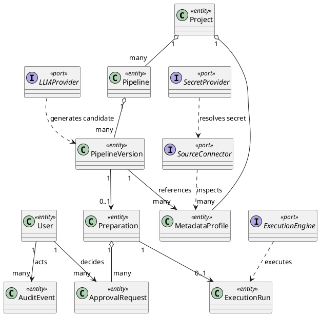

# ETL-Agent UML 类图

本文件描述 MVP 的核心领域对象和扩展接口。PlantUML 源文件位于 `docs/architecture/diagrams/ETLAgent领域类图_ETLAgentDomainClass.puml`，可使用 PlantUML 或 IDE 插件生成 PNG/SVG。图中 `<<port>>` 表示扩展端口，`<<entity>>` 表示持久化业务实体。

## 1. 领域关系

## 2. 设计说明

- `PipelineVersion` 是不可变制品边界，任何修复都创建新版本。
- `Preparation` 只引用冻结版本和 Profile 摘要，不把实时查询结果混入审批。
- `ApprovalRequest` 按 required role 建模，避免把两个 Checker 合并成一个布尔字段。
- `ExecutionRun` 只由 Commit 事务创建，Worker 不能自行创建未授权运行。
- `LLMProvider`、`SourceConnector`、`ExecutionEngine` 和 `SecretProvider` 是替换点，MVP 只实现最小适配器。
- `AuditEvent` 记录关键状态变化和哈希链，不能作为普通业务日志覆盖更新。

## 3. MVP 类实现顺序

1. `User`、`Project`、Membership/RoleGrant。
2. `Pipeline`、`PipelineVersion`、`MetadataProfile`。
3. `Preparation`、`ApprovalRequest`、`ExecutionRun`。
4. `LLMProvider`、`SourceConnector`、`SecretProvider` 端口及 fake adapter。
5. `ExecutionEngine` SeaTunnel adapter、Outbox 和 AuditEvent。

详细字段以需求文档第 6 节数据实体和后续数据库设计为准；类图不替代迁移脚本。
